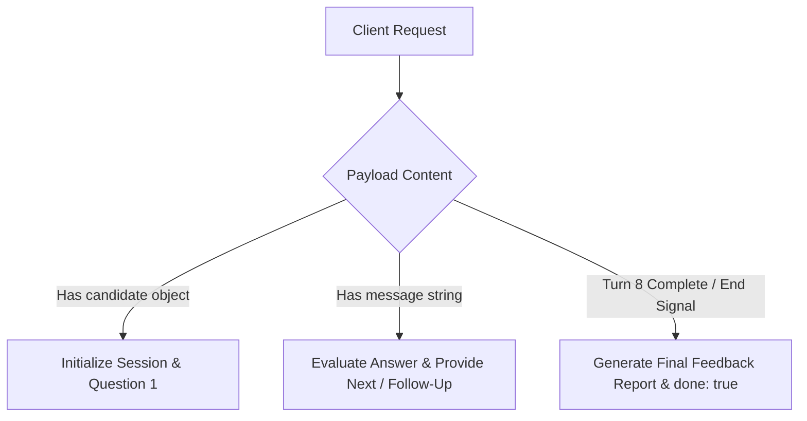

# API Reference & Integration Documentation

**Project:** InterviewIQ AI — Autonomous Technical Interview Agent  
**Base URL (Cloud Production):** `https://ai-interview-agent-rf0q.onrender.com`  
**Base URL (Local Development):** `http://localhost:8000`  
**Interactive Swagger Docs:** `https://ai-interview-agent-rf0q.onrender.com/docs`  
**OpenAPI Specification:** `https://ai-interview-agent-rf0q.onrender.com/openapi.json`  

---

## 1. Overview & Headers

All API endpoints accept and return `application/json`.

### Global Request Headers
| Header | Type | Description | Required |
|---|---|---|---|
| `Content-Type` | `string` | Must be `application/json` | Yes |
| `bypass-tunnel-reminder` | `string` | Set to `"true"` when testing via LocalTunnel | Optional (LocalTunnel only) |

---

## 2. Official Specification Endpoint: `POST /api/interview`

The primary interview engine is encapsulated in a unified, single-endpoint interface conforming strictly to the hackathon technical specification. It handles all three phases of the interview lifecycle:



---

### Turn 1: Initialize Interview Session

Initializes a personalized interview based on candidate missions and past performance signals.

* **Endpoint:** `POST /api/interview`
* **Method:** `POST`

#### Request Body
```json
{
  "sessionId": "session-sarah-101",
  "candidate": {
    "member": {
      "id": "CAND-001",
      "name": "Sarah Johnson",
      "jobRole": "Senior Data Engineer",
      "yearsExperience": 9,
      "education": "MS Computer Science",
      "status": "COMPLETED"
    },
    "missions": [
      { "day": 7, "title": "Embeddings Explained", "passed": true, "attempts": 1 },
      { "day": 8, "title": "Vector Databases Overview", "passed": true, "attempts": 1 },
      { "day": 10, "title": "Retrieval & Matching Engine", "passed": true, "attempts": 2 },
      { "day": 29, "title": "Monitoring, Logging & Observability", "skipped": true }
    ],
    "signals": {
      "commitDays": 28,
      "missionsCompleted": 30,
      "missionsFirstTry": 20
    }
  }
}
```

#### Response Body (`200 OK`)
```json
{
  "reply": "Welcome Sarah Johnson! Let's begin your technical interview for the Senior Data Engineer position.\n\nQuestion 1 (Day 7 - Embeddings Explained):\nWhat approach would you take to generate and store vector embeddings for a large corpus of unstructured clinical notes, and how would you evaluate embedding quality in terms of capturing semantic relationships?",
  "done": false,
  "feedback": null,
  "questionNumber": 1,
  "totalQuestions": 8,
  "currentTopic": "Embeddings Explained",
  "progress": "1 / 8"
}
```

---

### Turn 2–7: Conversation Turns (Answer Evaluation & Adaptive Follow-Up)

Submits the candidate's answer for real-time Groq LLM evaluation and generates the next curriculum question or adaptive follow-up.

* **Endpoint:** `POST /api/interview`
* **Method:** `POST`

#### Request Body
```json
{
  "sessionId": "session-sarah-101",
  "message": "I would use Sentence Transformers or domain-specific BioBERT models to generate dense embeddings, store them in ChromaDB with HNSW indexing, and evaluate semantic quality using cosine similarity benchmarks."
}
```

#### Response Body (`200 OK`)
```json
{
  "reply": "Good. Excellent answer. Demonstrates practical understanding of principles and best practices.\n\nNext Question (2/8 - Day 8 Vector Databases Overview):\nHow do you compare local vector storage like ChromaDB versus distributed cloud systems like Pinecone regarding latency, indexing time, and clustering trade-offs?",
  "done": false,
  "feedback": null,
  "questionNumber": 2,
  "totalQuestions": 8,
  "currentTopic": "Vector Databases Overview",
  "progress": "2 / 8"
}
```

---

### Turn 8: Interview Completion & Executive Scorecard

When the 8-question quota is reached or when the session is ended, the endpoint returns `done: true` along with the comprehensive `feedback` report.

#### Response Body (`200 OK`)
```json
{
  "reply": "Interview completed! Thank you for your comprehensive answers. Your final technical evaluation and performance feedback report have been generated.",
  "done": true,
  "feedback": {
    "summary": "Sarah Johnson completed the technical evaluation for Senior Data Engineer. Demonstrated solid competence across 4 curriculum modules with an overall technical performance score of 78.5/100. Recommendation: HIRE.",
    "strengths": [
      "Strong understanding of Embeddings Explained: demonstrated clear fundamentals and production best practices.",
      "Clear articulation of structured JSON logging pipelines with Fluent Bit, Kafka, and Elasticsearch",
      "Solid grasp of vector indexing trade-offs and latency optimization"
    ],
    "gaps": [
      "Deepen understanding of Multi-Agent Orchestration failure recovery mechanisms",
      "Review Model Context Protocol (MCP) tool schema definitions and error handling"
    ],
    "improvements": [
      "Deepen understanding of Multi-Agent Orchestration failure recovery mechanisms",
      "Review Model Context Protocol (MCP) tool schema definitions and error handling"
    ],
    "areasToImprove": [
      "Deepen understanding of Multi-Agent Orchestration failure recovery mechanisms",
      "Review Model Context Protocol (MCP) tool schema definitions and error handling"
    ],
    "next": [
      "Build end-to-end multi-agent orchestration projects using LangGraph and MCP",
      "Deep dive into vector search indexing, hybrid retrieval, and latency benchmarks",
      "Practice live containerization and Kubernetes cluster deployment for AI workloads"
    ],
    "recommendation": "HIRE"
  },
  "questionNumber": 8,
  "totalQuestions": 8,
  "currentTopic": "Monitoring, Logging & Observability",
  "progress": "8 / 8"
}
```

---

## 3. Modular REST Endpoints

In addition to the unified endpoint, the backend provides modular endpoints for custom dashboard integrations:

### 1. Health Check
* **Endpoint:** `GET /health`
* **Response:**
  ```json
  {
    "status": "healthy",
    "project": "InterviewIQ AI"
  }
  ```

### 2. Candidate Feedback Report
* **Endpoint:** `GET /feedback/{session_id}` (Aliases: `/api/feedback/{session_id}`, `/api/interview/feedback/{session_id}`)
* **Response:**
  ```json
  {
    "session_id": "session-sarah-101",
    "candidate_name": "Sarah Johnson",
    "candidate_id": "CAND-001",
    "role": "Senior Data Engineer",
    "overall_score": 78.5,
    "total_questions": 8,
    "curriculum_days_covered": 4,
    "topic_wise_scores": {
      "Embeddings & Vector Search": 80.0,
      "Monitoring & Observability": 85.0,
      "Agentic AI & MCP": 70.0
    },
    "strengths": [
      "Strong understanding of Embeddings & Vector Search",
      "Clear technical communication and structured problem solving"
    ],
    "improvements": [
      "Needs further revision in Multi-Agent Orchestration failure recoveries"
    ],
    "gaps": [
      "Needs further revision in Multi-Agent Orchestration failure recoveries"
    ],
    "areasToImprove": [
      "Needs further revision in Multi-Agent Orchestration failure recoveries"
    ],
    "next": [
      "Build end-to-end multi-agent orchestration projects using LangGraph and MCP"
    ],
    "recommendation": "HIRE",
    "summary": "Sarah Johnson completed the technical evaluation with solid competence."
  }
  ```

---

## 4. Error Handling & Status Codes

| HTTP Status | Meaning | Description |
|---|---|---|
| `200 OK` | Success | Request was successfully processed. |
| `201 Created` | Resource Created | Session was initialized successfully. |
| `400 Bad Request` | Validation Error | Missing required fields in the request body. |
| `404 Not Found` | Not Found | Session ID was not found. |
| `500 Server Error` | Internal Server Error | Handled gracefully with fallback heuristics. |

---

## 5. cURL Verification Examples

```bash
# 1. Start Interview Turn
curl -X POST "https://ai-interview-agent-rf0q.onrender.com/api/interview" \
     -H "Content-Type: application/json" \
     -d '{
       "sessionId": "test-sess-1",
       "candidate": {
         "member": { "id": "CAND-001", "name": "Sarah Johnson", "jobRole": "Senior Data Engineer" },
         "missions": [{ "day": 7, "title": "Embeddings Explained", "passed": true, "attempts": 1 }]
       }
     }'

# 2. Answer Question Turn
curl -X POST "https://ai-interview-agent-rf0q.onrender.com/api/interview" \
     -H "Content-Type: application/json" \
     -d '{
       "sessionId": "test-sess-1",
       "message": "We use sentence-transformers and store embeddings in ChromaDB with cosine similarity."
     }'

# 3. Check Feedback Report
curl -X GET "https://ai-interview-agent-rf0q.onrender.com/feedback/test-sess-1"
```
