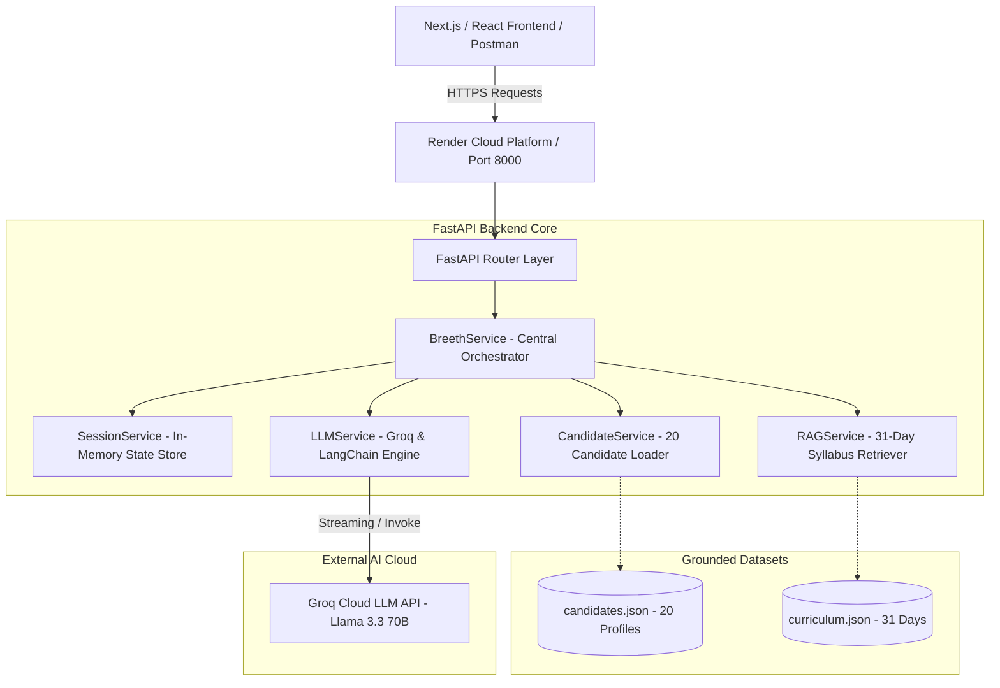
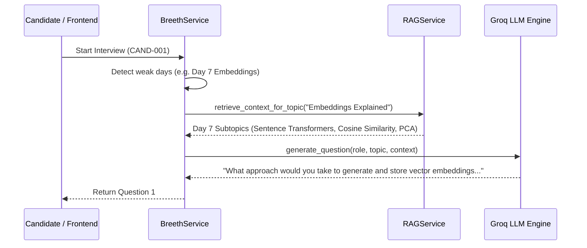

# System Architecture & Technical Design

**Project:** InterviewIQ AI — Autonomous Technical Interview Agent  
**Backend Framework:** FastAPI (Python 3.11)  
**LLM Engine:** Groq Cloud (`llama-3.3-70b-versatile`) + LangChain  
**Knowledge Base:** 31-Day AI Cohort Curriculum RAG Retriever  

---

## 1. High-Level Architecture Diagram

---

## 2. Multi-Layer Design

The backend is built with strict separation of concerns, ensuring high scalability, testability, and resilience:

### 1. Presentation & Routing Layer (`backend/routes/`)
* **`interview.py`:** Hosts the official unified `POST /api/interview` orchestrator route as well as modular dashboard endpoints (`/start-interview`, `/next-question`, `/submit-answer`, `/end-interview`).
* **`feedback.py`:** Exposes comprehensive scorecard retrieval endpoints (`GET /feedback/{session_id}`) with multi-path aliases.
* **`health.py`:** Lightweight liveness and readiness probe (`GET /health`).

### 2. Orchestration Layer (`backend/services/breeth_service.py`)
Acts as the central conductor coordinating:
* Candidate profile gap analysis.
* RAG syllabus subtopic retrieval for grounded question synthesis.
* Turn-by-turn answer evaluation and adaptive follow-up triggering.
* Session termination and multi-dimensional scorecard generation on Turn 8.

### 3. Intelligence & RAG Layer (`backend/services/`)
* **`rag_service.py`:** Parses `curriculum.json` into semantic curriculum documents, retrieving exact day topics, subtopics, and objectives.
* **`llm_services.py`:** Connects to Groq Cloud LLM using LangChain. Implements zero-shot JSON prompting with graceful heuristic fallbacks for high uptime.
* **`candidate_service.py`:** Loads and analyzes candidate mission logs to target skipped or high-attempt days.

### 4. State & Persistence Layer (`backend/services/session_service.py`)
* Thread-safe, in-memory session manager tracking candidate answers, scores, asked question history, and covered curriculum days.

---

## 3. Grounding & RAG Retrieval Mechanism

To prevent hallucinated or overly generic programming questions, every question is strictly grounded in the **31-Day AI Cohort Syllabus**:

---

## 4. LLM Scoring & Adaptive Follow-Up Engine

Each candidate response is scored on a multi-dimensional scale (1 to 10):

| Score | Rating Category | Adaptive Action |
|---|---|---|
| **9–10** | Exceptional Mastery | Progress to next advanced curriculum day. |
| **7–8** | Solid Understanding | Acknowledge best practices, proceed to next day. |
| **5–6** | Surface Level / Basic | Trigger an **Adaptive Follow-Up** drilling into production trade-offs. |
| **1–4** | Inadequate / Gibberish / Skipped | Flag critical knowledge gap, trigger fundamental critique follow-up. |

---

## 5. Security & Secret Isolation

1. **Environment Isolation:** All sensitive credentials (`GROQ_API_KEY`, `BREETH_API_KEY`) are managed strictly via `.env` and loaded securely through `backend/config.py`.
2. **Git Protection:** `.env` is locked in `.gitignore` and verified via `git check-ignore` to ensure zero token leakage.
3. **CORS Security:** Configured with `CORSMiddleware` supporting Next.js frontends and local tunnel integration.
