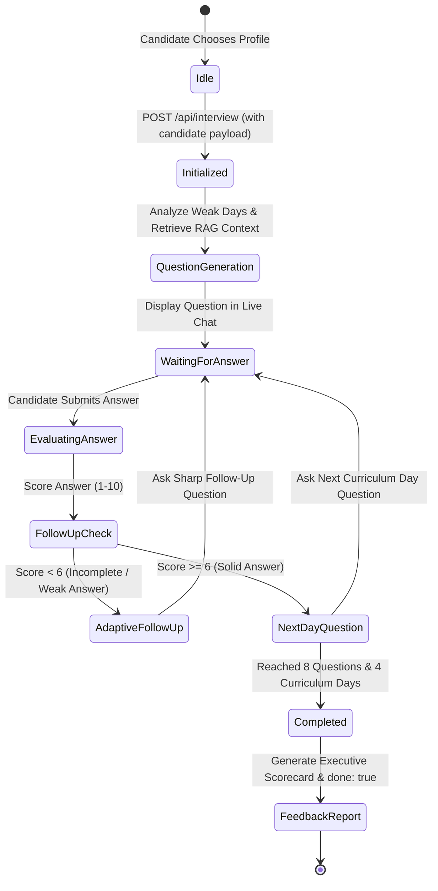
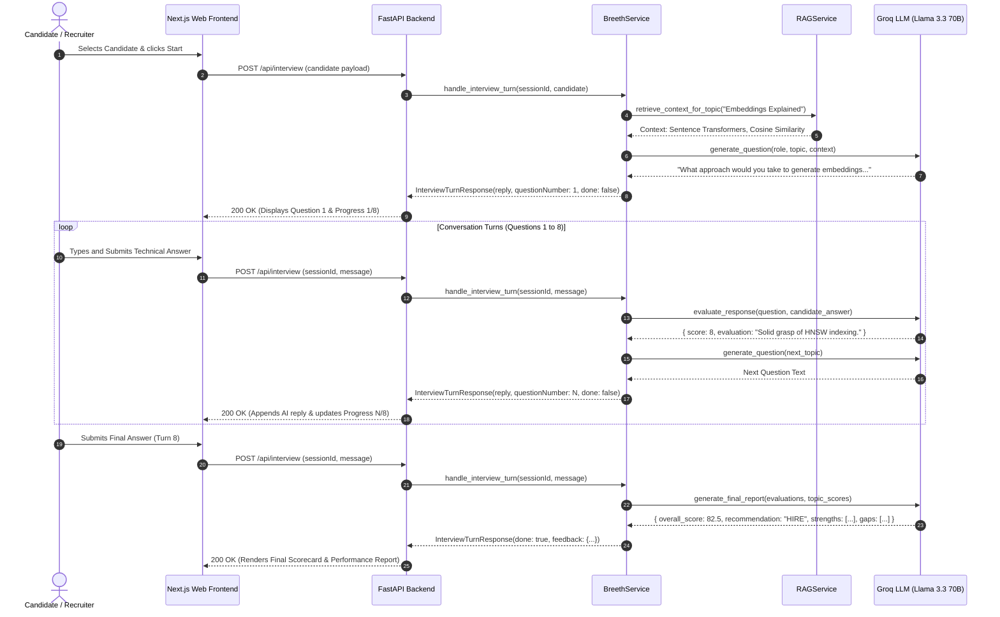

# Interview Lifecycle & Workflow Documentation

**Project:** InterviewIQ AI — Autonomous Technical Interview Agent  
**Standard Flow:** 8 Technical Questions · Min 4 Curriculum Modules · Real-Time Adaptive Follow-Ups  

---

## 1. End-to-End Interview State Machine

---

## 2. Step-by-Step Workflow Phases

### Phase 1: Candidate Initialization & Gap Discovery
1. The recruiter or user selects one of the 20 pre-configured candidates (e.g. `Sarah Johnson` - `CAND-001`).
2. The frontend sends the candidate payload to `POST /api/interview`.
3. The backend orchestrator scans the candidate's `missions` array:
   * Identifies skipped missions (e.g. Day 29 Logging & Observability).
   * Identifies high-attempt missions (attempts >= 3).
4. The system retrieves grounded subtopics from `curriculum.json` and synthesizes **Question 1**.

---

### Phase 2: Conversational Evaluation & Adaptive Follow-Up Loop
1. The candidate types their answer in the chat interface and clicks **Submit**.
2. The payload `{ sessionId, message }` is dispatched to `POST /api/interview`.
3. **Groq LLM Engine Evaluation:**
   * **Correctness & Architecture Depth:** Analyzes accuracy, trade-offs, and tool selection.
   * **Score Assignment:** Evaluated from 1 to 10.
   * **Gibberish & Skip Handling:** Inadequate responses (`skip`, `hiiii`, random keys) are immediately flagged (Score 1/10).
4. **Branching Decision:**
   * **If Score < 6:** Generates a constructive 2-sentence critique and an **Adaptive Follow-Up** drilling into the missing mechanics.
   * **If Score >= 6:** Advances to the next curriculum module day (e.g. Vector Databases → LangChain Agents → MCP → Kubernetes).

---

### Phase 3: Session Termination & Executive Scorecard Synthesis
1. When the candidate completes **Question 8**:
   * The session state is marked as `completed`.
   * The orchestrator compiles all turn scores and answers.
2. The system computes:
   * **Overall Technical Score** (Percentage 0–100%).
   * **Topic-Wise Breakdown** (Vector Search, RAG, Logging, Multi-Agent).
   * **Strengths List** (Topics with score >= 7).
   * **Areas to Improve / Gaps** (Topics with score < 7).
   * **Hiring Recommendation** (`STRONG HIRE`, `HIRE`, `CONSIDER / JUNIOR ROLE`, `NEEDS IMPROVEMENT`).
3. The response returns `done: true` and the complete `feedback` object, transitioning the frontend to the Final Report Screen.

---

## 3. Detailed Sequence Diagram

